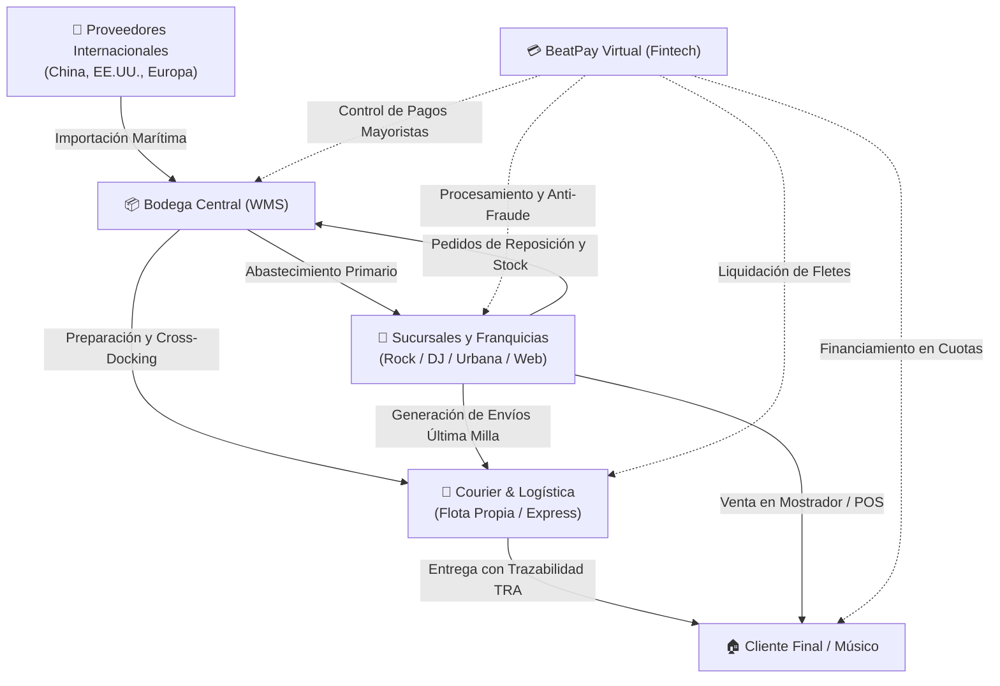

# MusicPro Enterprise Suite v2.4 - Documentación Central y Análisis del Negocio

Bienvenido a la documentación técnica, estratégica y de negocio de la suite **MusicPro Enterprise v2.4**, la plataforma unificada de gestión comercial, logística omnicanal, WMS y servicios financieros desarrollada para **Music Pro Company**.

Este documento integra en profundidad la **visión corporativa, el contexto histórico, la estrategia de transformación digital y los objetivos del Plan 26-30** expuestos en la presentación ejecutiva del proyecto ([PresentacionMusicPro.pdf](PresentacionMusicPro.pdf)).

---

## 📑 Tabla de Contenidos

1. [Visión Estratégica y Análisis del Negocio (Presentación Corporativa)](#-visión-estratégica-y-análisis-del-negocio)
   * [Orígenes y Trayectoria (Providencia, 1980 - 2000)](#orígenes-y-trayectoria-providencia-1980---2000)
   * [El Concepto de Retail Segmentado por Género Musical](#el-concepto-de-retail-segmentado-por-género-musical)
   * [El Desafío Covid-19 y la Urgencia Digital](#el-desafío-covid-19-y-la-urgencia-digital)
   * [Hito Marzo 2026: Levantamiento de Capital y Nuevo CEO](#hito-marzo-2026-levantamiento-de-capital-y-nuevo-ceo)
   * [Los 11 Pilares Estratégicos de Acción](#los-11-pilares-estratégicos-de-acción)
   * [Metas y Plazos Clave del Proyecto (Deadlines)](#metas-y-plazos-clave-del-proyecto-deadlines)
2. [Ecosistema de Integración Triangular y Flujo Operativo](#-ecosistema-de-integración-triangular-y-flujo-operativo)
3. [Los 4 Sistemas de la Suite Tecnológica](#-los-4-sistemas-de-la-suite-tecnológica)
   * [1. Bodega Principal (WMS & Supply Chain)](#1-bodega-principal-wms--supply-chain)
   * [2. Sucursales y Franquicias (E-Commerce & Retail POS)](#2-sucursales-y-franquicias-e-commerce--retail-pos)
   * [3. Courier Proveedor - Cliente (Logística y Flota)](#3-courier-proveedor---cliente-logística-y-flota)
   * [4. BeatPay Virtual (Fintech & Pagos Musicales)](#4-beatpay-virtual-fintech--pagos-musicales)
4. [Matrices de Requisitos Formales (1.000 Requisitos de Software)](#-matrices-de-requisitos-formales-1000-requisitos-de-software)
5. [Diagramas de Flujo de Usuario UX & Transición de Pantallas](#-diagramas-de-flujo-de-usuario-ux--transición-de-pantallas)
6. [Modelo de Base de Datos Relacional (ERD & Diccionario)](#-modelo-de-base-de-datos-relacional-erd--diccionario)
7. [Arquitectura del Repositorio y Estructura de Archivos](#-arquitectura-del-repositorio-y-estructura-de-archivos)
8. [Estándar de Componentes y Assets Modulares](#-estándar-de-componentes-y-assets-modulares)
9. [Visualización y Acceso al Hub Central](#-visualización-y-acceso-al-hub-central)
10. [Autor y Créditos](#-autor-y-créditos)

---

## 🎯 Visión Estratégica y Análisis del Negocio

El proyecto **MusicPro Enterprise Suite** responde a la evolución histórica y a las necesidades operativas de **Music Pro Company**, distribuidor e importador de instrumentos y equipamiento de audio profesional.

### Orígenes y Trayectoria (Providencia, 1980 - 2000)
* **Años 1980:** Fundación en la comuna de **Providencia, Santiago de Chile**, orientada a suplir la creciente demanda de músicos locales con instrumentos de cuerda, viento y percusión.
* **1988:** Consolidación de liderazgo en distribución mayorista en la Región Metropolitana.
* **Años 1990:** Establecimiento de alianzas de importación directa con fabricantes mundiales líderes de guitarras acústicas/eléctricas, bajos, baterías, amplificadores, consolas y micrófonos.
* **Año 2000:** Apertura de 4 tiendas físicas de referencia, consolidando una base de clientes de aficionados, estudiantes y músicos profesionales.

### El Concepto de Retail Segmentado por Género Musical
Para brindar una experiencia de compra personalizada y romper con la frialdad de las tiendas tradicionales de música, Music Pro Company diseñó un modelo de **sucursales especializadas por cultura musical**:
* 🎸 **Sucursal del Rock:** Especializada en guitarras eléctricas, bajos, pedales análogos y amplificadores valvulares de alto calibre.
* 🎧 **Sucursal del DJ:** Dedicada a tornamesas, controladores, consolas de mezcla, monitores de estudio, iluminación y software de producción electrónica.
* 🥁 **Sucursal de Reggaetón y Cumbia:** Diseñada para sintetizadores de ritmos latinos, percusión urbana (timbales, congas, güiras) y micrófonos dinámicos para espectáculos en vivo.

### El Desafío Covid-19 y la Urgencia Digital
La llegada de la pandemia de Covid-19 obligó al cierre temporal de las sucursales físicas, evidenciando debilidades operativas críticas:
1. **Falta de canal online unificado:** Las ventas migraron orgánicamente a redes sociales (vendedores gestionando pedidos por Instagram y WhatsApp), lo que generó desorden en los inventarios.
2. **Productos estrella en confinamiento:** Se desató una demanda explosiva por instrumentos de estudio en casa y aprendizaje personal, principalmente **ukeleles y baterías electrónicas silenciosas**.
3. **Necesidad de despacho inmediato:** Los clientes exigían tiempos de entrega menores a **24 horas**, lo que impulsó la decisión estratégica de crear un almacén central de despacho rápido con control automatizado de stock y seguimiento en tiempo real.

### Hito Marzo 2026: Levantamiento de Capital y Nuevo CEO
En **marzo de 2026** (anunciado en el diario corporativo *Volume 101*), Music Pro Company concretó un **levantamiento de capital institucional** y nombró a un **nuevo CEO** con el mandato explícito de liderar la transformación digital del negocio mediante el **Music Pro Tour (Plan 26-30)**.

### Los 11 Pilares Estratégicos de Acción
El plan quinquenal 2026-2030 define 11 frentes de crecimiento corporativo:
1. **Expansión Internacional:** Apertura de distribución y centros logísticos en mercados clave de Latinoamérica.
2. **I+D y Marca Propia:** Desarrollo de accesorios e instrumentos con especificaciones de la marca.
3. **Experiencia de Cliente Omnicanal:** Sincronización transparente entre la tienda digital y las sucursales físicas.
4. **Modernización de Tiendas Físicas:** Integración de terminales POS interactivos y quioscos digitales de autoatención.
5. **Marketing y Branding Musical:** Alianzas con artistas, festivales y creadores de contenido.
6. **Fundación Music Pro:** Donación de instrumentos y capacitación técnica a escuelas de música en zonas vulnerables.
7. **Escalabilidad de Venta Online:** Plataforma e-commerce de alto rendimiento capaz de resistir eventos de alta demanda.
8. **Modelo de Franquicias:** Expansión nacional y regional a través de franquiciados con sistemas estandarizados.
9. **Precios y Convenios Competitivos:** Optimización de la cadena de suministro internacional.
10. **Diversificación de Catálogo:** Inclusión de equipamiento para podcasting, streaming y producción en casa.
11. **Educación Musical:** Clínicas de instrumentos y talleres impartidos en el ecosistema físico y virtual.

### Metas y Plazos Clave del Proyecto (Deadlines)
La dirección ejecutiva fijó tres hitos ineludibles para la suite tecnológica:
* ⏱️ **6 Meses:** Despliegue integral de la suite de software unificada en la Bodega Central y en todas las sucursales y franquicias activas.
* 📦 **9 Meses:** Incrementar la capacidad efectiva de almacenamiento, slotting y despacho de la bodega central en un **+50%**.
* 📈 **12 Meses:** Incrementar las ventas totales en un **+20%** a nivel interanual a través de la sinergia omnicanal.

---

## 🔄 Ecosistema de Integración Triangular y Flujo Operativo

La suite conecta los cuatro nodos neurálgicos del negocio en un flujo en tiempo real sin fisuras:



### El Flujo de Información y Dinero:
1. **Bodega (WMS):** Almacena y clasifica el stock entrante, ejecutando picking por olas y despachando tanto a sucursales como directo a clientes finales.
2. **Sucursales (E-commerce / POS):** Ofrecen el catálogo omnicanal, sincronizan el stock en tiempo real con Bodega y generan guías de despacho.
3. **Transporte (Courier):** Retira la carga, imprime etiquetas normalizadas (4x6"), calcula rutas óptimas de despacho y entrega bajo firma digital (POD).
4. **BeatPay Virtual:** Financia las compras de instrumentos, audita el riesgo crediticio, asegura las transacciones contra el fraude y liquida las cuentas a los distintos centros de costo.

---

## 📦 Los 4 Sistemas de la Suite Tecnológica

### 1. Bodega Principal (WMS & Supply Chain)
* **Objetivo:** Maximizar la densidad de almacenamiento y la velocidad de despacho en la bodega central.
* **Capacidades Principales:**
  * Gestión de muelles de recepción y validación de guías de importación.
  * Algoritmos de *slotting* inteligente según rotación ABC de productos.
  * Trazabilidad unitaria por número de serie (fundamental en guitarras de colección y consolas de alto valor).
  * Control estricto de mermas, auditorías cíclicas e historial kardex inmutable.
  * 15 vistas para administradores y 7 vistas operativas para operadores de bodega.
  * [Ver Documentación y Vistas de Bodega](Bodega/README.md) | [Requisitos de Bodega](Bodega/requerimientos.html).

### 2. Sucursales y Franquicias (E-Commerce & Retail POS)
* **Objetivo:** Brindar una experiencia de compra omnicanal adaptada a las sucursales especializadas (Rock, DJ, Reggaetón/Cumbia) y al portal web.
* **Capacidades Principales:**
  * Catálogo interactivo con filtrado por género, marca y reproductor de demos de audio.
  * Carrito reactivo con cálculo automático de flete y reserva preventiva de stock.
  * Terminal de Punto de Venta (POS) para vendedores en sucursales físicas con soporte para lectores de código de barras.
  * Motor de promociones, cupones y fidelización de clientes.
  * 12 vistas administrativas y 13 vistas de clientes/vendedores.
  * [Ver Documentación y Vistas de Tienda](Tienda/README.md) | [Requisitos de Tienda](Tienda/requerimientos.html).

### 3. Courier Proveedor - Cliente (Logística y Flota)
* **Objetivo:** Gestionar la distribución física desde la bodega central hacia sucursales y domicilios de clientes finales en < 24 horas.
* **Capacidades Principales:**
  * Generación de código unificado de rastreo (formato `TRA-YYYY-XXXXXX`).
  * Emisión automática de etiquetas térmicas estándar de despacho (formato 4x6" con código QR y Code128).
  * Panel de despacho y asignación inteligente de cargas a vehículos y transportistas.
  * Confirmación de entrega digital (Proof of Delivery - POD) con captura de firma táctil y coordenadas GPS.
  * 12 vistas de administración de flota y 12 vistas para seguimiento de clientes y transportistas.
  * [Ver Documentación y Vistas de Transporte](Transporte/README.md) | [Requisitos de Transporte](Transporte/requerimientos.html).

### 4. BeatPay Virtual (Fintech & Pagos Musicales)
* **Objetivo:** Democratizar el acceso a instrumentos profesionales y entradas a conciertos mediante soluciones financieras digitales.
* **Nombre Oficial:** **BeatPay Virtual** (*"La tarjeta digital para los amantes de la música y los conciertos"*).
* **Capacidades Principales:**
  * Emisión instantánea de tarjetas virtuales con CVV dinámico y tokenización de seguridad.
  * Otorgamiento de líneas de crédito rotativas con simulación de cuotas sin interés para compras de equipamiento musical.
  * Motor de detección de fraude en tiempo real basado en scores de riesgo transaccional.
  * Billetera virtual, abono de fondos en moneda local y presupuestos automáticos para compras en eventos.
  * 12 vistas de administración financiera/riesgo y 10 vistas de banca digital para el usuario final.
  * [Ver Documentación y Vistas de Tarjeta](Tarjeta/README.md) | [Requisitos de Tarjeta](Tarjeta/requerimientos.html).

---

## 📋 Matrices de Requisitos Formales (1.000 Requisitos de Software)

Para garantizar la calidad de software de clase empresarial, cada sistema cuenta con una especificación formal de **250 requerimientos de ingeniería de software** (desglosados en 100 Requerimientos Funcionales, 50 Requerimientos No Funcionales y 100 Requerimientos de Diseño & UI):

| Subsistema | Requerimientos Funcionales (RF) | Requerimientos No Funcionales (RNF) | Requerimientos de Diseño (RD) | Total Requisitos | Especificación Interactiva | Especificación Markdown |
| :--- | :---: | :---: | :---: | :---: | :---: | :---: |
| **Bodega (WMS)** | 100 RF | 50 RNF | 100 RD | **250** | [Bodega/requerimientos.html](Bodega/requerimientos.html) | [Bodega/requisitos.md](Bodega/requisitos.md) |
| **Tienda (E-Commerce/POS)** | 100 RF | 50 RNF | 100 RD | **250** | [Tienda/requerimientos.html](Tienda/requerimientos.html) | [Tienda/requisitos.md](Tienda/requisitos.md) |
| **Transporte (Courier)** | 100 RF | 50 RNF | 100 RD | **250** | [Transporte/requerimientos.html](Transporte/requerimientos.html) | [Transporte/requisitos.md](Transporte/requisitos.md) |
| **Tarjeta (BeatPay Virtual)** | 100 RF | 50 RNF | 100 RD | **250** | [Tarjeta/requerimientos.html](Tarjeta/requerimientos.html) | [Tarjeta/requisitos.md](Tarjeta/requisitos.md) |
| **TOTAL SUITE** | **400 RF** | **200 RNF** | **400 RD** | **1.000** | [Hub Central (index.html)](index.html) | [requisitos.md](requisitos.md) |

*Cada tabla interactiva incluye filtros instantáneos por perfil de usuario (**Administrador**, **Mantenedor**, **Cliente**, **Sistema**), selector por tipo de requisito y barra de búsqueda en vivo construida con Tailwind CSS.*

---

## 🔀 Diagramas de Flujo de Usuario UX & Transición de Pantallas

Para comprender la experiencia de usuario y la navegación entre las más de 80 vistas HTML del proyecto, se construyó una suite interactiva de diagramas de flujo con **Mermaid.js v10**:

* 🌐 **Aplicación Interactiva:** [diagrama-flujo.html](diagrama-flujo.html) (con controles de zoom, pan, exportación SVG y selector de pestañas por módulo).
* 📄 **Especificación en Markdown:** [diagrama-flujo.md](diagrama-flujo.md) (diagramas Mermaid nativos y matriz de transición pantalla por pantalla).

### Cobertura de Flujos UX:
1. **Ecosistema Global Integrado:** Ciclo omnicanal desde la navegación web de instrumentos hasta la entrega por courier y el cobro en cuotas vía BeatPay.
2. **Bodega WMS:** Flujo B2B de sucursales solicitando stock vs. panel de administración operando recepción, slotting y picking por olas.
3. **Tienda & Retail POS:** Compra online en 2 pasos con audio demos MP3 vs. operación de venta rápida en mostrador para cajeros.
4. **Transporte Express:** Emisión de guía TRA, etiqueta térmica 4x6" y tracking satelital vs. despacho de rutas y confirmación POD con firma digital.
5. **BeatPay Virtual:** Onboarding de tarjeta con CVV dinámico y simulador de avances vs. motor antifraude y auditoría de transacciones.

---

## 🗄️ Modelo de Base de Datos Relacional (ERD & Diccionario)

La persistencia de la suite está soportada por un **modelo relacional normalizado en 3FN**, diseñado para soportar alta transaccionalidad y consistencia en inventario, ventas y pagos:

* 🌐 **Visualizador ERD Interactivo:** [base-de-datos.html](base-de-datos.html) (diagramas Entidad-Relación interactivos con Mermaid, buscador en el diccionario de datos y botón para copiar script SQL).
* 📄 **Especificación y DDL en Markdown:** [base-de-datos.md](base-de-datos.md) (script SQL completo DDL listo para PostgreSQL/MySQL y diccionario tabular de columnas).

### Módulos del Modelo Relacional:
* **Módulo Central (`usuarios`, `sucursales`):** Identidad federada y red de tiendas temáticas (Rock, DJ, Reggaetón/Cumbia, Central).
* **Módulo Bodega (`bodega_articulos`, `bodega_ubicaciones`, `bodega_series`, `bodega_movimientos`, `bodega_solicitudes`):** Trazabilidad física y kardex inmutable.
* **Módulo Tienda (`tienda_productos`, `tienda_cupones`, `tienda_ordenes`, `tienda_ordenes_items`):** Catálogo comercial con precio BeatPay y facturación.
* **Módulo Transporte (`transporte_vehiculos`, `transporte_conductores`, `transporte_rutas`, `transporte_envios`, `transporte_entregas_pod`):** Flota, código TRA y comprobante POD.
* **Módulo Tarjeta (`tarjeta_cuentas`, `tarjeta_plasticos_virtuales`, `tarjeta_transacciones`, `tarjeta_avances`, `tarjeta_reglas_fraude`):** Líneas rotativas, tokenización y score de riesgo.

---

## 🏛️ Arquitectura del Repositorio y Estructura de Archivos

```text
c:\Users\benja\Desktop\musicpro\
├── index.html                      <-- Hub principal de presentación y visualizador del PDF
├── PresentacionMusicPro.pdf        <-- Presentación ejecutiva corporativa (25 láminas, 27.3 MB)
├── README.md                       <-- Documentación central, técnica y de negocio
├── requisitos.md                   <-- Requisitos globales de la suite
├── diagrama-flujo.html             <-- Visor interactivo de Flujos de Usuario (Mermaid)
├── diagrama-flujo.md               <-- Respaldo Markdown de Flujos y transición de pantallas
├── base-de-datos.html              <-- Visor interactivo de Modelo ERD y Diccionario SQL
├── base-de-datos.md                <-- Respaldo Markdown de Esquema Relacional y Script DDL
├── shared/                         <-- Componentes transversales
│   └── modal-system.js             <-- Sistema universal de modales (alert, confirm, prompt)
│
├── Bodega/                         <-- Sistema WMS y Cadena de Suministro
│   ├── README.md
│   ├── requisitos.md
│   ├── requerimientos.html         <-- Tabla interactiva con 250 requisitos
│   ├── assets/ ({css,js}/{admin,cliente})
│   ├── admin/ (15 vistas HTML)
│   └── cliente/ (7 vistas HTML)
│
├── Tarjeta/                        <-- Sistema BeatPay Virtual (Fintech & Pagos)
│   ├── README.md
│   ├── requisitos.md
│   ├── requerimientos.html         <-- Tabla interactiva con 250 requisitos
│   ├── assets/ ({css,js}/{admin,cliente})
│   ├── admin/ (12 vistas HTML)
│   └── cliente/ (10 vistas HTML)
│
├── Tienda/                         <-- Sistema E-Commerce & Retail POS
│   ├── README.md
│   ├── requisitos.md
│   ├── requerimientos.html         <-- Tabla interactiva con 250 requisitos
│   ├── assets/ ({css,js}/{admin,cliente})
│   ├── admin/ (12 vistas HTML)
│   └── cliente/ (13 vistas HTML)
│
└── Transporte/                     <-- Sistema Logística, Envíos & Flota Courier
    ├── README.md
    ├── requisitos.md
    ├── requerimientos.html         <-- Tabla interactiva con 250 requisitos
    ├── assets/ ({css,js}/{admin,cliente})
    ├── admin/ (12 vistas HTML)
    └── cliente/ (12 vistas HTML)
```

---

## ⚡ Estándar de Componentes y Assets Modulares

1. **Tokens y Paletas HSL (`assets/css/components.css`):**
   * Paletas de color adaptadas a la identidad de cada subsistema (ámbar/dorado para Bodega, violeta/neón para BeatPay, azul/cyan para Transporte y carmesí para Tienda).
   * Tipografías de alta legibilidad: *Plus Jakarta Sans* para interfaz, *Outfit* para encabezados y *Share Tech Mono* para códigos de seguimiento y seriales.
2. **Namespaces de Lógica JavaScript (`assets/js/components.js`):**
   * Encapsulación de estados para evitar colisiones: `BodegaWMS`, `TarjetaFintech`, `TiendaStore`, `TransporteExpress`.
   * Manejadores estandarizados de notificaciones toast, modales de confirmación accesibles y validación de formularios.
3. **Aislamiento por Vista:**
   * Cada una de las más de 80 vistas HTML cuenta con su archivo `.css` y `.js` correspondiente, lo que garantiza tiempos de carga mínimos y facilidad de mantenimiento.

---

## 🚀 Visualización y Acceso al Hub Central

1. **Abrir el Portal:** Ejecuta o abre [index.html](index.html) en tu navegador preferido.
2. **Presentación Ejecutiva:**
   * Haz clic en **"Visualizar Presentación (PDF)"** en la barra superior o en el hero del [index.html](index.html) para abrir el visor nativo integrado de alto rendimiento.
   * También puedes acceder al documento directamente en una nueva pestaña mediante [PresentacionMusicPro.pdf](PresentacionMusicPro.pdf) o descargarlo para revisión offline.
3. **Exploración de Módulos:** Desde el hub principal puedes acceder con un clic a cualquiera de las vistas administrativas u operativas de los cuatro subsistemas, así como a las matrices interactivas de requisitos.

---

## 👨‍💻 Autor & Créditos

* **Creador y Desarrollador Principal:** [Bemtorres](https://github.com/Bemtorres)
* **Perfil de GitHub:** [@Bemtorres](https://github.com/Bemtorres)
* **Organización:** Music Pro Company
* **Proyecto:** MusicPro Enterprise Suite v2.4 (Bodega WMS, Tienda E-Commerce, Transporte Courier y BeatPay Virtual)
* **Lema Corporativo:** *¿Y tú qué esperas... SÚBETEEE!!!!*
