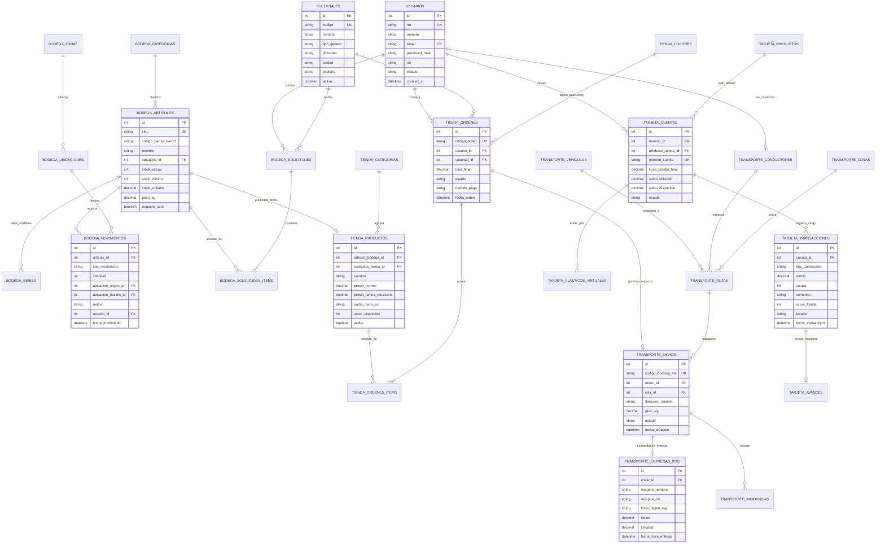

# Modelo de Base de Datos Relacional - MusicPro Enterprise Suite v2.4

Este documento contiene la especificación formal del **Modelo de Base de Datos Entidad-Relación (ER)** para la suite corporativa **MusicPro Company**, integrando los 4 subsistemas (**Bodega WMS**, **Tienda E-Commerce/POS**, **Transporte Courier** y **BeatPay Virtual Fintech**).

---

## 📑 Tabla de Contenidos
1. [Diagrama Entidad-Relación Global (Mermaid ERD)](#1-diagrama-entidad-relación-global)
2. [Arquitectura de Esquema por Módulos](#2-arquitectura-de-esquema-por-módulos)
   * [2.1 Módulo Central: Usuarios y Sucursales](#21-módulo-central-usuarios-y-sucursales)
   * [2.2 Módulo Bodega WMS (Gestión de Almacenes e Inventarios)](#22-módulo-bodega-wms)
   * [2.3 Módulo Tienda E-Commerce & Retail POS](#23-módulo-tienda-e-commerce--retail-pos)
   * [2.4 Módulo Transporte Express & Courier](#24-módulo-transporte-express--courier)
   * [2.5 Módulo BeatPay Virtual (Fintech & Pagos Musicales)](#25-módulo-beatpay-virtual)
3. [Diccionario de Datos Detallado](#3-diccionario-de-datos-detallado)
4. [Script DDL en SQL Estándar (PostgreSQL / MySQL Compliant)](#4-script-ddl-en-sql-estándar)

---

## 1. Diagrama Entidad-Relación Global



---

## 2. Arquitectura de Esquema por Módulos

### 2.1 Módulo Central: Usuarios y Sucursales
Orquesta la identidad corporativa y el acceso a los 4 portales.
* **`usuarios`**: Soporta autenticación unificada para administradores de bodega, cajeros de sucursales, transportistas y compradores.
* **`sucursales`**: Gestiona las sucursales especializadas de Music Pro (*Sucursal del Rock*, *Sucursal del DJ*, *Sucursal de Reggaetón y Cumbia*) y la Bodega Central.

### 2.2 Módulo Bodega WMS
Control de almacenamiento de alta densidad, trazabilidad de números de serie y logística inversa.
* **`bodega_zonas`** y **`bodega_ubicaciones`**: Mapeo tridimensional de pasillos, racks y niveles.
* **`bodega_articulos`** y **`bodega_series`**: Control unitario de instrumentos de alto valor (guitarras eléctricas, tornamesas, sintetizadores).
* **`bodega_movimientos`**: Registro inmutable kardex (entradas, transferencias internas, bajas por merma).
* **`bodega_solicitudes`** y **`bodega_solicitudes_items`**: Pedidos de reabastecimiento levantados por sucursales B2B.

### 2.3 Módulo Tienda E-Commerce & Retail POS
Venta omnicanal web y cajas físicas de atención al público.
* **`tienda_productos`**: Vinculado al SKU del WMS, incorpora muestras de audio demo en MP3 y precios preferenciales con BeatPay.
* **`tienda_cupones`**: Motor de descuentos con fechas de vigencia y topes monetarios.
* **`tienda_ordenes`** y **`tienda_ordenes_items`**: Cesta de compras, liquidación de impuestos (IVA) y despacho.

### 2.4 Módulo Transporte Express & Courier
Operación de última milla con compromiso de entrega en < 24 horas.
* **`transporte_vehiculos`** y **`transporte_conductores`**: Capacidad cúbica de flete y control de chóferes.
* **`transporte_rutas`**: Secuencia optimizada de paradas por zona geográfica.
* **`transporte_envios`**: Trazabilidad unificada con código de rastreo `TRA-YYYY-XXXXXX`.
* **`transporte_entregas_pod`**: Prueba digital de entrega (Proof of Delivery) con coordenadas GPS y firma táctil.

### 2.5 Módulo BeatPay Virtual
Banca digital para músicos y amantes de los conciertos.
* **`tarjeta_cuentas`**: Línea de crédito rotativa y saldo disponible en tiempo real.
* **`tarjeta_plasticos_virtuales`**: Tokenización de seguridad con CVV dinámico.
* **`tarjeta_transacciones`**: Autorización inmediata en cuotas sin interés y motor de score de fraude.
* **`tarjeta_avances`**: Simulación y transferencia de efectivo a cuenta bancaria con cálculo de CAE y costo total.

---

## 3. Diccionario de Datos Detallado

| Tabla | Columna | Tipo de Dato | Nulo | Clave | Descripción |
| :--- | :--- | :--- | :---: | :---: | :--- |
| **`usuarios`** | `id` | `INT` | No | PK | Identificador único autoincremental |
| | `rut` | `VARCHAR(12)` | No | UK | Cédula nacional chilena (ej: 12.345.678-9) |
| | `nombre` | `VARCHAR(150)` | No | | Nombre y apellido del usuario |
| | `email` | `VARCHAR(150)` | No | UK | Correo electrónico corporativo o personal |
| | `password_hash` | `VARCHAR(255)` | No | | Hash seguro bcrypt/argon2 |
| | `rol` | `ENUM` | No | | `ADMIN`, `MANTENEDOR`, `CLIENTE` |
| | `estado` | `ENUM` | No | | `ACTIVO`, `BLOQUEADO`, `SUSPENDIDO` |
| **`bodega_articulos`** | `id` | `INT` | No | PK | ID interno del artículo de almacén |
| | `sku` | `VARCHAR(50)` | No | UK | Código SKU único del fabricante (ej: GTR-FEN-STRAT-01) |
| | `codigo_barras_ean13` | `VARCHAR(20)` | Sí | | Código EAN-13 para pistolas lectoras |
| | `nombre` | `VARCHAR(200)` | No | | Nombre comercial del instrumento musical |
| | `categoria_id` | `INT` | No | FK | Referencia a `bodega_categorias(id)` |
| | `stock_actual` | `INT` | No | | Existencia física consolidada en WMS |
| | `stock_minimo` | `INT` | No | | Umbral para alerta automática de reposición |
| | `costo_unitario` | `DECIMAL(12,2)` | No | | Costo de adquisición neto en CLP |
| | `requiere_serie` | `BOOLEAN` | No | | `TRUE` si cada unidad tiene número de serie |
| **`tienda_productos`** | `id` | `INT` | No | PK | ID del producto publicado en vitrina |
| | `articulo_bodega_id` | `INT` | No | FK, UK | Enlace al catálogo maestro de WMS |
| | `precio_normal` | `DECIMAL(12,2)` | No | | Precio regular de venta a público |
| | `precio_tarjeta_musicpro`| `DECIMAL(12,2)` | No | | Precio con descuento BeatPay Virtual |
| | `audio_demo_url` | `VARCHAR(255)` | Sí | | URL del archivo MP3 de demostración musical |
| | `stock_disponible` | `INT` | No | | Stock sincronizado para venta online |
| **`transporte_envios`** | `id` | `INT` | No | PK | ID interno del despacho |
| | `codigo_tracking_tra`| `VARCHAR(30)` | No | UK | Código de rastreo público (ej: TRA-2026-948172) |
| | `orden_id` | `INT` | Sí | FK | Referencia a `tienda_ordenes(id)` |
| | `ruta_id` | `INT` | Sí | FK | Referencia a `transporte_rutas(id)` |
| | `estado` | `ENUM` | No | | `RECOLECTADO`, `EN_TRANSITO`, `EN_REPARTO`, `ENTREGADO` |
| **`tarjeta_cuentas`** | `id` | `INT` | No | PK | ID de la cuenta BeatPay |
| | `usuario_id` | `INT` | No | FK | Referencia a `usuarios(id)` |
| | `numero_cuenta` | `VARCHAR(30)` | No | UK | Número de contrato financiero |
| | `linea_credito_total` | `DECIMAL(12,2)` | No | | Cupo crediticio aprobado en CLP |
| | `saldo_disponible` | `DECIMAL(12,2)` | No | | Saldo remanente para compras o avances |
| | `estado` | `ENUM` | No | | `ACTIVA`, `BLOQUEADA_PREVENTIVA`, `CERRADA` |

---

## 4. Script DDL en SQL Estándar

A continuación se entrega el script SQL listo para ejecutar en motores relacionales modernos (PostgreSQL / MySQL 8+):

```sql
-- ==========================================================
-- MUSICPRO ENTERPRISE SUITE v2.4 - ESQUEMA RELACIONAL DDL
-- Creado por Bemtorres para Music Pro Company
-- ==========================================================

-- 1. MODULO CENTRAL Y SUCURSALES
CREATE TABLE usuarios (
    id SERIAL PRIMARY KEY,
    rut VARCHAR(12) NOT NULL UNIQUE,
    nombre VARCHAR(150) NOT NULL,
    email VARCHAR(150) NOT NULL UNIQUE,
    password_hash VARCHAR(255) NOT NULL,
    rol VARCHAR(20) NOT NULL CHECK (rol IN ('ADMIN', 'MANTENEDOR', 'CLIENTE')),
    estado VARCHAR(20) DEFAULT 'ACTIVO' CHECK (estado IN ('ACTIVO', 'BLOQUEADO', 'SUSPENDIDO')),
    created_at TIMESTAMP DEFAULT CURRENT_TIMESTAMP
);

CREATE TABLE sucursales (
    id SERIAL PRIMARY KEY,
    codigo VARCHAR(20) NOT NULL UNIQUE,
    nombre VARCHAR(100) NOT NULL,
    tipo_genero VARCHAR(30) NOT NULL CHECK (tipo_genero IN ('ROCK', 'DJ', 'REGGAETON_CUMBIA', 'CENTRAL')),
    direccion VARCHAR(255) NOT NULL,
    ciudad VARCHAR(100) NOT NULL,
    telefono VARCHAR(20),
    activa BOOLEAN DEFAULT TRUE
);

-- 2. MODULO BODEGA WMS
CREATE TABLE bodega_zonas (
    id SERIAL PRIMARY KEY,
    codigo VARCHAR(10) NOT NULL UNIQUE,
    nombre VARCHAR(100) NOT NULL,
    activa BOOLEAN DEFAULT TRUE
);

CREATE TABLE bodega_ubicaciones (
    id SERIAL PRIMARY KEY,
    zona_id INT NOT NULL REFERENCES bodega_zonas(id),
    pasillo VARCHAR(5) NOT NULL,
    rack VARCHAR(5) NOT NULL,
    nivel INT NOT NULL,
    posicion INT NOT NULL,
    codigo_slot VARCHAR(25) NOT NULL UNIQUE,
    capacidad_kg DECIMAL(10,2) DEFAULT 1000.00,
    ocupada BOOLEAN DEFAULT FALSE
);

CREATE TABLE bodega_categorias (
    id SERIAL PRIMARY KEY,
    nombre VARCHAR(100) NOT NULL,
    descripcion TEXT
);

CREATE TABLE bodega_articulos (
    id SERIAL PRIMARY KEY,
    sku VARCHAR(50) NOT NULL UNIQUE,
    codigo_barras_ean13 VARCHAR(20),
    nombre VARCHAR(200) NOT NULL,
    categoria_id INT NOT NULL REFERENCES bodega_categorias(id),
    stock_actual INT DEFAULT 0 CHECK (stock_actual >= 0),
    stock_minimo INT DEFAULT 5,
    costo_unitario DECIMAL(12,2) NOT NULL,
    peso_kg DECIMAL(8,2) DEFAULT 1.00,
    requiere_serie BOOLEAN DEFAULT FALSE
);

CREATE TABLE bodega_series (
    id SERIAL PRIMARY KEY,
    articulo_id INT NOT NULL REFERENCES bodega_articulos(id),
    numero_serie VARCHAR(100) NOT NULL UNIQUE,
    estado VARCHAR(20) DEFAULT 'DISPONIBLE' CHECK (estado IN ('DISPONIBLE', 'RESERVADO', 'DESPACHADO', 'MERMA')),
    ubicacion_id INT REFERENCES bodega_ubicaciones(id)
);

CREATE TABLE bodega_movimientos (
    id SERIAL PRIMARY KEY,
    articulo_id INT NOT NULL REFERENCES bodega_articulos(id),
    tipo_movimiento VARCHAR(20) NOT NULL CHECK (tipo_movimiento IN ('ENTRADA', 'SALIDA', 'AJUSTE_POSITIVO', 'AJUSTE_NEGATIVO', 'TRASLADO')),
    cantidad INT NOT NULL,
    ubicacion_origen_id INT REFERENCES bodega_ubicaciones(id),
    ubicacion_destino_id INT REFERENCES bodega_ubicaciones(id),
    motivo VARCHAR(200) NOT NULL,
    usuario_id INT NOT NULL REFERENCES usuarios(id),
    fecha_movimiento TIMESTAMP DEFAULT CURRENT_TIMESTAMP
);

CREATE TABLE bodega_solicitudes (
    id SERIAL PRIMARY KEY,
    codigo_solicitud VARCHAR(30) NOT NULL UNIQUE,
    sucursal_id INT NOT NULL REFERENCES sucursales(id),
    usuario_id INT NOT NULL REFERENCES usuarios(id),
    estado VARCHAR(20) DEFAULT 'BORRADOR' CHECK (estado IN ('BORRADOR', 'SOLICITADA', 'APROBADA', 'EN_PICKING', 'DESPACHADA')),
    prioridad VARCHAR(15) DEFAULT 'MEDIA' CHECK (prioridad IN ('BAJA', 'MEDIA', 'ALTA', 'URGENTE')),
    fecha_creacion TIMESTAMP DEFAULT CURRENT_TIMESTAMP,
    fecha_requerida DATE
);

CREATE TABLE bodega_solicitudes_items (
    id SERIAL PRIMARY KEY,
    solicitud_id INT NOT NULL REFERENCES bodega_solicitudes(id) ON DELETE CASCADE,
    articulo_id INT NOT NULL REFERENCES bodega_articulos(id),
    cantidad_solicitada INT NOT NULL,
    cantidad_despachada INT DEFAULT 0
);

-- 3. MODULO TIENDA E-COMMERCE & POS
CREATE TABLE tienda_categorias (
    id SERIAL PRIMARY KEY,
    nombre VARCHAR(100) NOT NULL,
    genero_musical VARCHAR(30) NOT NULL CHECK (genero_musical IN ('ROCK', 'DJ', 'URBANO', 'TODOS')),
    slug VARCHAR(120) NOT NULL UNIQUE
);

CREATE TABLE tienda_productos (
    id SERIAL PRIMARY KEY,
    articulo_bodega_id INT NOT NULL UNIQUE REFERENCES bodega_articulos(id),
    categoria_tienda_id INT NOT NULL REFERENCES tienda_categorias(id),
    nombre VARCHAR(200) NOT NULL,
    descripcion TEXT,
    precio_normal DECIMAL(12,2) NOT NULL,
    precio_tarjeta_musicpro DECIMAL(12,2) NOT NULL,
    audio_demo_url VARCHAR(255),
    stock_disponible INT DEFAULT 0,
    activo BOOLEAN DEFAULT TRUE
);

CREATE TABLE tienda_cupones (
    id SERIAL PRIMARY KEY,
    codigo VARCHAR(30) NOT NULL UNIQUE,
    porcentaje_descuento DECIMAL(5,2) DEFAULT 0,
    tope_descuento DECIMAL(12,2) DEFAULT 0,
    fecha_expiracion DATE,
    usos_maximos INT DEFAULT 100,
    usos_actuales INT DEFAULT 0,
    activo BOOLEAN DEFAULT TRUE
);

CREATE TABLE tienda_ordenes (
    id SERIAL PRIMARY KEY,
    codigo_orden VARCHAR(40) NOT NULL UNIQUE,
    usuario_id INT NOT NULL REFERENCES usuarios(id),
    sucursal_id INT REFERENCES sucursales(id),
    cupon_id INT REFERENCES tienda_cupones(id),
    total_neto DECIMAL(12,2) NOT NULL,
    iva DECIMAL(12,2) NOT NULL,
    total_flete DECIMAL(12,2) DEFAULT 0,
    total_descuento DECIMAL(12,2) DEFAULT 0,
    total_final DECIMAL(12,2) NOT NULL,
    estado VARCHAR(20) DEFAULT 'PENDIENTE' CHECK (estado IN ('PENDIENTE', 'PAGADA', 'PREPARANDO', 'DESPACHADA', 'CANCELADA')),
    metodo_pago VARCHAR(30) NOT NULL CHECK (metodo_pago IN ('BEATPAY_VIRTUAL', 'WEBPAY_CREDITO', 'WEBPAY_DEBITO', 'EFECTIVO_POS')),
    canal VARCHAR(20) DEFAULT 'ONLINE' CHECK (canal IN ('ONLINE', 'POS_SUCURSAL')),
    fecha_orden TIMESTAMP DEFAULT CURRENT_TIMESTAMP
);

CREATE TABLE tienda_ordenes_items (
    id SERIAL PRIMARY KEY,
    orden_id INT NOT NULL REFERENCES tienda_ordenes(id) ON DELETE CASCADE,
    producto_id INT NOT NULL REFERENCES tienda_productos(id),
    cantidad INT NOT NULL,
    precio_unitario DECIMAL(12,2) NOT NULL,
    subtotal DECIMAL(12,2) NOT NULL
);

-- 4. MODULO TRANSPORTE EXPRESS COURIER
CREATE TABLE transporte_vehiculos (
    id SERIAL PRIMARY KEY,
    patente VARCHAR(10) NOT NULL UNIQUE,
    marca VARCHAR(50) NOT NULL,
    modelo VARCHAR(50) NOT NULL,
    capacidad_kg DECIMAL(10,2) NOT NULL,
    volumen_m3 DECIMAL(8,2) NOT NULL,
    estado VARCHAR(20) DEFAULT 'DISPONIBLE' CHECK (estado IN ('DISPONIBLE', 'EN_RUTA', 'EN_TALLER', 'BAJA'))
);

CREATE TABLE transporte_conductores (
    id SERIAL PRIMARY KEY,
    usuario_id INT NOT NULL UNIQUE REFERENCES usuarios(id),
    rut VARCHAR(12) NOT NULL UNIQUE,
    tipo_licencia VARCHAR(10) NOT NULL,
    telefono VARCHAR(20),
    estado VARCHAR(20) DEFAULT 'ACTIVO' CHECK (estado IN ('ACTIVO', 'EN_REPARTO', 'LICENCIA', 'INACTIVO'))
);

CREATE TABLE transporte_zonas (
    id SERIAL PRIMARY KEY,
    nombre_zona VARCHAR(100) NOT NULL,
    tarifa_base DECIMAL(10,2) NOT NULL,
    factor_km DECIMAL(10,2) DEFAULT 1.00,
    plazo_sla_horas INT DEFAULT 24
);

CREATE TABLE transporte_rutas (
    id SERIAL PRIMARY KEY,
    codigo_ruta VARCHAR(30) NOT NULL UNIQUE,
    conductor_id INT NOT NULL REFERENCES transporte_conductores(id),
    vehiculo_id INT NOT NULL REFERENCES transporte_vehiculos(id),
    zona_id INT NOT NULL REFERENCES transporte_zonas(id),
    fecha_ruta DATE NOT NULL,
    estado VARCHAR(20) DEFAULT 'PROGRAMADA' CHECK (estado IN ('PROGRAMADA', 'EN_TRANSITO', 'FINALIZADA', 'CANCELADA'))
);

CREATE TABLE transporte_envios (
    id SERIAL PRIMARY KEY,
    codigo_tracking_tra VARCHAR(30) NOT NULL UNIQUE,
    orden_id INT REFERENCES tienda_ordenes(id),
    ruta_id INT REFERENCES transporte_rutas(id),
    direccion_origen VARCHAR(255) NOT NULL,
    direccion_destino VARCHAR(255) NOT NULL,
    peso_kg DECIMAL(8,2) NOT NULL,
    volumen_cm3 DECIMAL(10,2),
    remitente_nombre VARCHAR(150) NOT NULL,
    destinatario_nombre VARCHAR(150) NOT NULL,
    destinatario_telefono VARCHAR(20),
    estado VARCHAR(30) DEFAULT 'RECOLECTADO' CHECK (estado IN ('RECOLECTADO', 'EN_CENTRO_DISTRIBUCION', 'EN_REPARTO', 'ENTREGADO', 'INCIDENCIA')),
    fecha_creacion TIMESTAMP DEFAULT CURRENT_TIMESTAMP
);

CREATE TABLE transporte_entregas_pod (
    id SERIAL PRIMARY KEY,
    envio_id INT NOT NULL UNIQUE REFERENCES transporte_envios(id),
    receptor_nombre VARCHAR(150) NOT NULL,
    receptor_rut VARCHAR(12) NOT NULL,
    firma_digital_svg TEXT,
    latitud DECIMAL(10,8),
    longitud DECIMAL(11,8),
    fecha_hora_entrega TIMESTAMP DEFAULT CURRENT_TIMESTAMP
);

CREATE TABLE transporte_incidencias (
    id SERIAL PRIMARY KEY,
    envio_id INT NOT NULL REFERENCES transporte_envios(id),
    ruta_id INT REFERENCES transporte_rutas(id),
    motivo VARCHAR(100) NOT NULL,
    detalle TEXT,
    fecha_registro TIMESTAMP DEFAULT CURRENT_TIMESTAMP,
    resuelta BOOLEAN DEFAULT FALSE
);

-- 5. MODULO BEATPAY VIRTUAL (FINTECH)
CREATE TABLE tarjeta_productos (
    id SERIAL PRIMARY KEY,
    nombre VARCHAR(100) NOT NULL,
    segmento VARCHAR(30) NOT NULL CHECK (segmento IN ('CLASSIC', 'GOLD_ROCKER', 'VIP_PRODUCCION')),
    cupo_maximo DECIMAL(12,2) NOT NULL,
    tasa_interes_mensual DECIMAL(5,3) NOT NULL,
    cae_anual DECIMAL(5,2) NOT NULL,
    comision_mantencion DECIMAL(10,2) DEFAULT 0
);

CREATE TABLE tarjeta_cuentas (
    id SERIAL PRIMARY KEY,
    usuario_id INT NOT NULL REFERENCES usuarios(id),
    producto_tarjeta_id INT NOT NULL REFERENCES tarjeta_productos(id),
    numero_cuenta VARCHAR(30) NOT NULL UNIQUE,
    linea_credito_total DECIMAL(12,2) NOT NULL,
    saldo_utilizado DECIMAL(12,2) DEFAULT 0 CHECK (saldo_utilizado >= 0),
    saldo_disponible DECIMAL(12,2) NOT NULL CHECK (saldo_disponible >= 0),
    estado VARCHAR(25) DEFAULT 'ACTIVA' CHECK (estado IN ('ACTIVA', 'BLOQUEADA_PREVENTIVA', 'BLOQUEADA_CLIENTE', 'CERRADA')),
    fecha_apertura DATE DEFAULT CURRENT_DATE
);

CREATE TABLE tarjeta_plasticos_virtuales (
    id SERIAL PRIMARY KEY,
    cuenta_id INT NOT NULL REFERENCES tarjeta_cuentas(id),
    pan_enmascarado VARCHAR(20) NOT NULL,
    token_card VARCHAR(255) NOT NULL UNIQUE,
    mes_vencimiento INT NOT NULL CHECK (mes_vencimiento BETWEEN 1 AND 12),
    anio_vencimiento INT NOT NULL,
    cvv_dinamico_hash VARCHAR(255) NOT NULL,
    activa BOOLEAN DEFAULT TRUE
);

CREATE TABLE tarjeta_transacciones (
    id SERIAL PRIMARY KEY,
    cuenta_id INT NOT NULL REFERENCES tarjeta_cuentas(id),
    tipo_transaccion VARCHAR(25) NOT NULL CHECK (tipo_transaccion IN ('COMPRA_COMERCIO', 'AVANCE_EFECTIVO', 'PAGO_CUENTA', 'CANJE_PUNTOS')),
    monto DECIMAL(12,2) NOT NULL,
    cuotas INT DEFAULT 1 CHECK (cuotas >= 1),
    valor_cuota DECIMAL(12,2) NOT NULL,
    comercio VARCHAR(150) NOT NULL,
    score_fraude INT DEFAULT 10,
    estado VARCHAR(20) DEFAULT 'AUTORIZADA' CHECK (estado IN ('AUTORIZADA', 'RECHAZADA_FONDO', 'RECHAZADA_FRAUDE', 'REVERSADA')),
    fecha_transaccion TIMESTAMP DEFAULT CURRENT_TIMESTAMP
);

CREATE TABLE tarjeta_avances (
    id SERIAL PRIMARY KEY,
    transaccion_id INT NOT NULL UNIQUE REFERENCES tarjeta_transacciones(id),
    monto_solicitado DECIMAL(12,2) NOT NULL,
    cuotas INT NOT NULL,
    tasa_aplicada DECIMAL(5,3) NOT NULL,
    banco_destino VARCHAR(100) NOT NULL,
    cuenta_destino VARCHAR(50) NOT NULL,
    rut_titular_cuenta VARCHAR(12) NOT NULL,
    comprobante_voucher_hash VARCHAR(64) NOT NULL
);

CREATE TABLE tarjeta_reglas_fraude (
    id SERIAL PRIMARY KEY,
    regla_nombre VARCHAR(100) NOT NULL,
    condicion_json JSONB,
    score_impacto INT NOT NULL,
    accion VARCHAR(20) NOT NULL CHECK (accion IN ('PERMITIR', 'ALERTAR', 'REQUERIR_2FA', 'BLOQUEAR')),
    activa BOOLEAN DEFAULT TRUE
);
```

---

*Documento técnico de arquitectura de datos desarrollado por [Bemtorres](https://github.com/Bemtorres) para MusicPro Enterprise Suite v2.4.*
