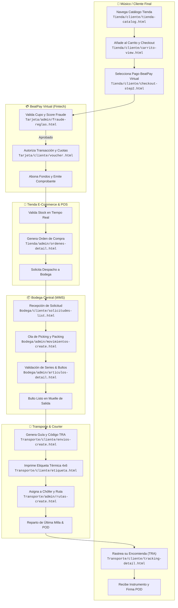
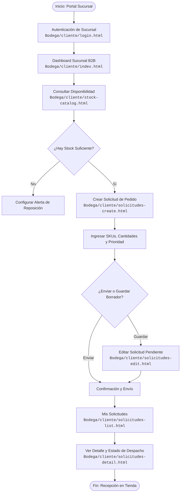
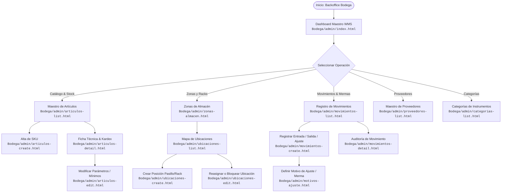
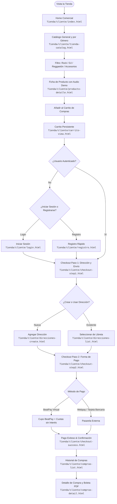
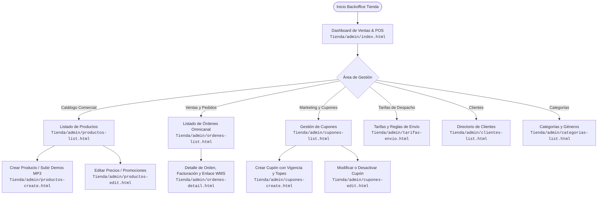
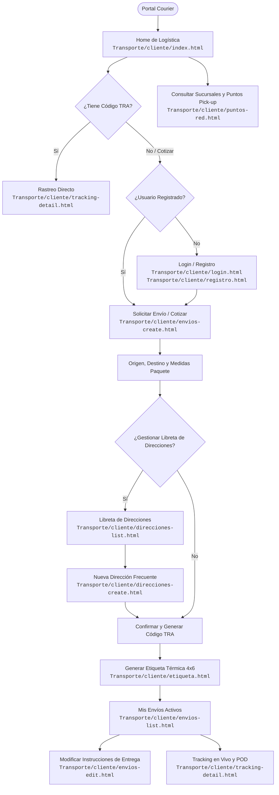
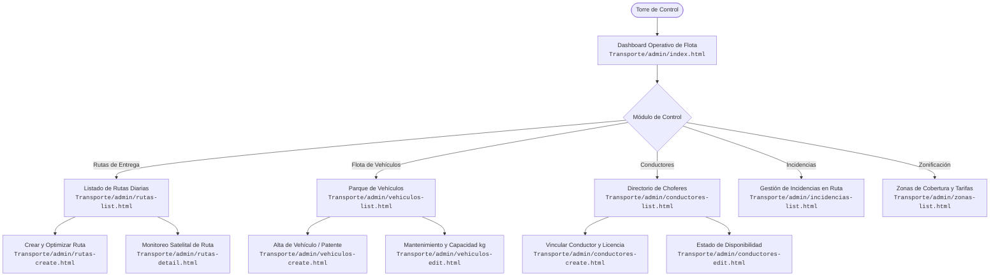
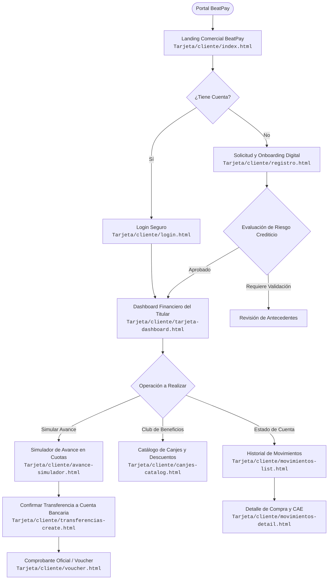
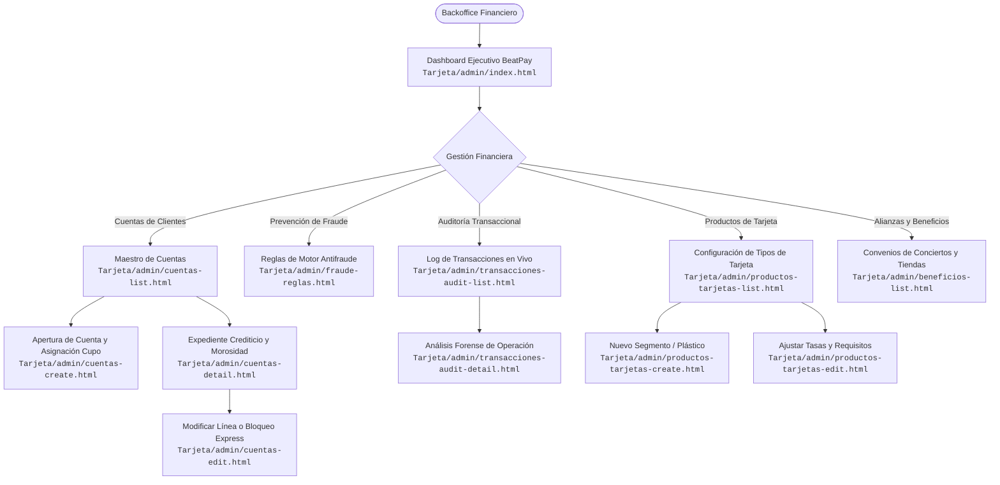

# Diagramas de Flujo de Usuario - MusicPro Enterprise Suite

Este documento contiene la especificación formal y el modelado de los **flujos de interacción de usuario** de los 4 subsistemas (**Bodega**, **Tienda**, **Transporte** y **Tarjeta/BeatPay**) más el **Ecosistema Global Integrado** de Music Pro Company.

Los diagramas están desarrollados en sintaxis nativa de **Mermaid** y mapean de manera fidedigna la estructura de pantallas y vistas HTML del repositorio.

---

## 📑 Índice de Flujos

1. [Ecosistema Global Integrado (Flujo Triangular Omnicanal)](#1-ecosistema-global-integrado)
2. [Sistema 1: Bodega WMS (Gestión de Almacenes e Inventario)](#2-sistema-de-bodega-wms)
   * [Flujo Cliente / Sucursal B2B (Receptor de Mercadería)](#flujo-bodega-cliente-b2b)
   * [Flujo Administrador / Jefe de Bodega (WMS Backoffice)](#flujo-bodega-administrador)
3. [Sistema 2: Tienda E-Commerce & Retail POS](#3-sistema-de-tienda-e-commerce--retail-pos)
   * [Flujo Cliente / Comprador (Front-Office Web)](#flujo-tienda-cliente)
   * [Flujo Administrador / Cajero POS (Backoffice & Retail)](#flujo-tienda-administrador)
4. [Sistema 3: Transporte Express & Courier](#4-sistema-de-transporte-express--courier)
   * [Flujo Cliente / Remitente & Destinatario](#flujo-transporte-cliente)
   * [Flujo Administrador / Despachador & Chófer](#flujo-transporte-administrador)
5. [Sistema 4: Tarjeta Financiera (BeatPay Virtual)](#5-sistema-de-tarjeta-financiera-beatpay-virtual)
   * [Flujo Cliente / Titular de Tarjeta](#flujo-tarjeta-cliente)
   * [Flujo Administrador / Analista de Riesgo & Fraude](#flujo-tarjeta-administrador)
6. [Matriz de Transición de Pantallas HTML](#6-matriz-de-transición-de-pantallas-html)

---

## 1. Ecosistema Global Integrado

El flujo global refleja la interacción orquestada entre la venta física/online, el abastecimiento logístico desde Bodega Central, la distribución en < 24h mediante Transporte y el financiamiento transversal con BeatPay Virtual.

---

## 2. Sistema de Bodega WMS

### Flujo Bodega Cliente B2B (Sucursales y Receptores)

Representa el viaje de un encargado de sucursal o franquicia que necesita reabastecer stock de instrumentos y accesorios desde la Bodega Central.

### Flujo Bodega Administrador (Jefe de Almacén & Operarios)

---

## 3. Sistema de Tienda E-Commerce & Retail POS

### Flujo Tienda Cliente (Comprador Web)

### Flujo Tienda Administrador & POS (Backoffice y Cajero de Sucursal)

---

## 4. Sistema de Transporte Express & Courier

### Flujo Transporte Cliente (Remitente y Destinatario)

### Flujo Transporte Administrador (Torre de Control & Chóferes)

---

## 5. Sistema de Tarjeta Financiera (BeatPay Virtual)

### Flujo Tarjeta Cliente (Titular de BeatPay Virtual)

### Flujo Tarjeta Administrador (Analista de Riesgo & Fraude)

---

## 6. Matriz de Transición de Pantallas HTML

A continuación se documenta el mapa de navegación exacto implementado en el código fuente de la suite:

### Módulo Bodega
| Vista Origen | Acción del Usuario | Vista Destino | Parámetro / Condición |
| :--- | :--- | :--- | :--- |
| `Bodega/cliente/login.html` | Click en "Ingresar a mi Portal" | `Bodega/cliente/index.html` | Credenciales de Sucursal válidas |
| `Bodega/cliente/index.html` | Click en "Ver Catálogo" | `Bodega/cliente/stock-catalog.html` | Explora existencias en WMS |
| `Bodega/cliente/stock-catalog.html`| Click en "Crear Solicitud" | `Bodega/cliente/solicitudes-create.html`| Precarga SKU seleccionado |
| `Bodega/cliente/solicitudes-create.html`| Submit de formulario | `Bodega/cliente/solicitudes-list.html` | Genera orden de pedido |
| `Bodega/cliente/solicitudes-list.html`| Click en botón "Ver" | `Bodega/cliente/solicitudes-detail.html` | ID de Solicitud |
| `Bodega/admin/articulos-list.html` | Click en "+ Nuevo Artículo" | `Bodega/admin/articulos-create.html` | Rol Administrador |
| `Bodega/admin/articulos-list.html` | Click en "Ver Kardex" | `Bodega/admin/articulos-detail.html` | ID de Artículo |
| `Bodega/admin/articulos-detail.html`| Click en "Editar" | `Bodega/admin/articulos-edit.html` | Modificación de stock mín. |
| `Bodega/admin/movimientos-list.html`| Click en "Nuevo Movimiento"| `Bodega/admin/movimientos-create.html` | Entrada, Salida o Ajuste |

### Módulo Tienda
| Vista Origen | Acción del Usuario | Vista Destino | Parámetro / Condición |
| :--- | :--- | :--- | :--- |
| `Tienda/cliente/index.html` | Click en "Explorar Tienda" | `Tienda/cliente/tienda-catalog.html` | Catálogo completo |
| `Tienda/cliente/tienda-catalog.html`| Click en card de instrumento | `Tienda/cliente/producto-detalle.html` | Muestra audio demo |
| `Tienda/cliente/producto-detalle.html`| Click en "Agregar al Carro" | `Tienda/cliente/carrito-view.html` | Persiste en LocalStorage |
| `Tienda/cliente/carrito-view.html` | Click en "Continuar Compra" | `Tienda/cliente/checkout-step1.html` | Validación de ítems |
| `Tienda/cliente/checkout-step1.html`| Confirmar Despacho | `Tienda/cliente/checkout-step2.html` | Dirección seleccionada |
| `Tienda/cliente/checkout-step2.html`| Seleccionar BeatPay y Pagar | `Tienda/cliente/checkout-success.html`| Validación de pago |
| `Tienda/cliente/checkout-success.html`| Click en "Mis Compras" | `Tienda/cliente/compras-list.html` | Consulta historial |
| `Tienda/admin/productos-list.html` | Click en "Nuevo Producto" | `Tienda/admin/productos-create.html` | Catálogo maestro |
| `Tienda/admin/ordenes-list.html` | Click en "Gestionar Orden" | `Tienda/admin/ordenes-detail.html` | Conexión con WMS/Courier |

### Módulo Transporte
| Vista Origen | Acción del Usuario | Vista Destino | Parámetro / Condición |
| :--- | :--- | :--- | :--- |
| `Transporte/cliente/index.html` | Búsqueda rápida por TRA | `Transporte/cliente/tracking-detail.html`| Código de rastreo |
| `Transporte/cliente/index.html` | Click en "Solicitar Envío" | `Transporte/cliente/envios-create.html` | Formulario de encomienda |
| `Transporte/cliente/envios-create.html`| Confirmar y Pagar Flete | `Transporte/cliente/etiqueta.html` | Genera código de barras 4x6 |
| `Transporte/cliente/envios-list.html`| Click en "Ver Seguimiento" | `Transporte/cliente/tracking-detail.html`| Timeline de 4 estados |
| `Transporte/admin/rutas-list.html` | Click en "Nueva Hoja de Ruta"| `Transporte/admin/rutas-create.html` | Selección de chofer y bultos |
| `Transporte/admin/rutas-list.html` | Click en "Monitorear" | `Transporte/admin/rutas-detail.html` | Telemetría en vivo |

### Módulo Tarjeta (BeatPay Virtual)
| Vista Origen | Acción del Usuario | Vista Destino | Parámetro / Condición |
| :--- | :--- | :--- | :--- |
| `Tarjeta/cliente/index.html` | Click en "Solicitar Tarjeta"| `Tarjeta/cliente/registro.html` | Formulario de postulación |
| `Tarjeta/cliente/login.html` | Iniciar Sesión con RUT | `Tarjeta/cliente/tarjeta-dashboard.html`| Acceso al portal cliente |
| `Tarjeta/cliente/tarjeta-dashboard.html`| Click en "Simular Avance" | `Tarjeta/cliente/avance-simulador.html` | Selector de cuotas y monto |
| `Tarjeta/cliente/avance-simulador.html`| Click en "Transferir Fondos"| `Tarjeta/cliente/transferencias-create.html`| Confirmación bancaria |
| `Tarjeta/cliente/transferencias-create.html`| Validación de seguridad | `Tarjeta/cliente/voucher.html` | Comprobante con firma digital |
| `Tarjeta/admin/cuentas-list.html` | Click en "Expediente" | `Tarjeta/admin/cuentas-detail.html` | Auditoría de cupo y riesgo |
| `Tarjeta/admin/fraude-reglas.html` | Configurar score de corte | `Tarjeta/admin/fraude-reglas.html` | Actualización de umbrales |
| `Tarjeta/admin/transacciones-audit-list.html`| Click en "Investigar" | `Tarjeta/admin/transacciones-audit-detail.html`| Trazabilidad de IP y BIN |

---

*Documento generado y mantenido por [Bemtorres](https://github.com/Bemtorres) para la suite corporativa MusicPro Enterprise v2.4.*
