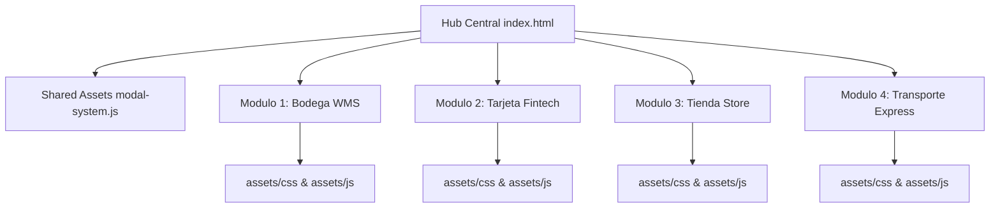

# Especificación Global de Requisitos del Software - MusicPro Suite

Este documento contiene la especificación detallada de los requisitos del software para la suite **MusicPro Enterprise v2.4**, abarcando requerimientos funcionales, no funcionales, de interfaz de usuario y de componentes para todos los subsistemas.

---

## 1. Requerimientos Funcionales Globales (RF-G)

| ID | Nombre | Descripción | Prioridad |
| :--- | :--- | :--- | :---: |
| **RF-G01** | **Hub Central de Navegación** | El sistema debe ofrecer una portada de presentación ([index.html](index.html)) con acceso interactivo a los 4 subsistemas independientes. | Alta |
| **RF-G02** | **Separación de Roles** | Cada subsistema debe diferenciar claramente las interfaces de **Cliente/Operador (Front-Office)** y **Administrativas (Back-Office)**. | Alta |
| **RF-G03** | **Sistema Universal de Modales** | El software debe reemplazar las llamadas nativas `alert()`, `confirm()` y `prompt()` por ventanas modales modernas y asíncronas ([shared/modal-system.js](shared/modal-system.js)). | Alta |
| **RF-G04** | **Navegación entre Sistemas** | Cada subsistema debe permitir el retorno al Hub Central mediante accesos directos visibles en la barra superior. | Media |
| **RF-G05** | **Notificaciones de Estado** | Todos los formularios e interacciones deben proporcionar retroalimentación visual mediante toasts o modales de confirmación. | Alta |

---

## 2. Requerimientos No Funcionales Globales (RNF-G)

| ID | Nombre | Criterio de Aceptación |
| :--- | :--- | :--- |
| **RNF-G01** | **Rendimiento de Carga** | El tiempo de renderizado de cualquier vista debe ser inferior a **200 ms** en conexiones locales o redes estándar. |
| **RNF-G02** | **Desacoplamiento de Activos** | Ninguna vista HTML debe contener scripts en línea ni estilos pesados embebidos; todo código debe residir en `assets/css` y `assets/js`. |
| **RNF-G03** | **Compatibilidad Multi-Navegador** | Compatible al 100% con Google Chrome, Mozilla Firefox, Microsoft Edge y Safari en versiones modernas. |
| **RNF-G04** | **Diseño Adaptativo (Responsive)** | Las interfaces deben adaptarse fluidamente a pantallas de escritorio (1920x1080), laptops (1366x768) y dispositivos móviles (375x812). |
| **RNF-G05** | **Cero Dependencias Pesadas** | El sistema funciona en HTML5/JS Vanilla sin requerir compiladores ni servidores Node.js obligatorios para la ejecución del frontend. |

---

## 3. Requerimientos de Interfaz de Usuario (UI/UX)

| ID | Elemento de Interfaz | Especificación Visual / Patrón |
| :--- | :--- | :--- |
| **RI-G01** | **Tipografía Sistema** | Uso estricto de *Plus Jakarta Sans* para texto de cuerpo, *Outfit* para encabezados y *Share Tech Mono* para códigos (SKU, PAN, Tracking). |
| **RI-G02** | **Paleta de Colores** | • Bodega: Tonos Amber/Dark Slate. • Tarjeta: Tonos Gold/Slate Fintech. • Tienda: Tonos Indigo/Violet E-Commerce. • Transporte: Tonos Cyan/Blue Logistics. |
| **RI-G03** | **Micro-animaciones** | Efectos de elevación (`hover:translate-y-1`), transiciones suaves (`transition-all duration-200`) y pulso en indicadores activos. |
| **RI-G04** | **Formularios Estandarizados** | Anillos de enfoque visibles (`focus:ring-2`), etiquetas claras y validaciones en tiempo real antes del envío. |

---

## 4. Requerimientos de Componentes del Software (RC)

### Detalle de Componentes Estructurados:
1. **Componentes Globales (`shared/`):**
   * `modal-system.js`: Motor universal de modales accesible mediante llamadas síncronas o promesas `async/await`.
2. **Componentes de Módulo (`[Proyecto]/assets/`):**
   * `components.css`: Hojas de estilos compartidas con tokens, animaciones y clases utilitarias de componentes.
   * `components.js`: Objeto Namespace global (`BodegaWMS`, `TarjetaFintech`, `TiendaStore`, `TransporteExpress`) para manejar formateadores y utilidades.
3. **Componentes de Vista (`assets/{css,js}/{admin,cliente}/[vista].*`):**
   * Un controlador JS y una hoja CSS por cada una de las 93 vistas HTML del sistema.
